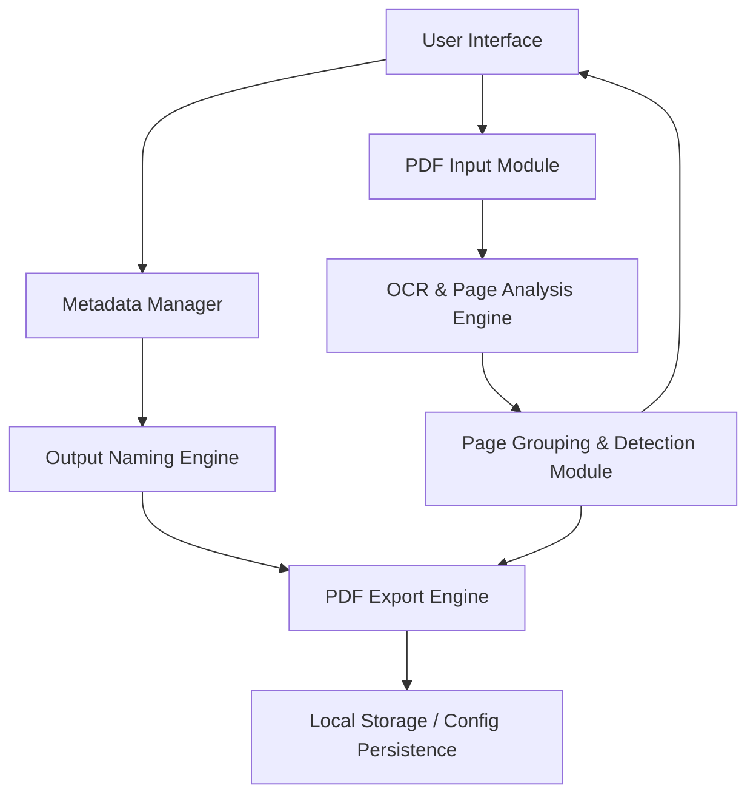
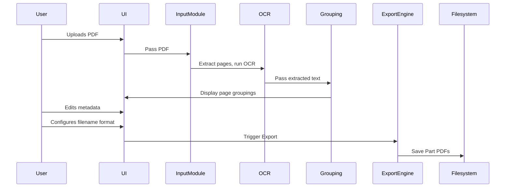

# Technical Architecture Document: PDF Splitter for Scanned Music Scores

## Document Version
- **Version**: 1.0  
- **Date**: 2025-04-20  
- **Author**: Florian Knierim

---

## Table of Contents

1. [Purpose](#1-purpose)  
2. [System Overview](#2-system-overview)  
3. [Architecture Diagram](#3-architecture-diagram)  
4. [Modules and Components](#4-modules-and-components)  
5. [Data Flow](#5-data-flow)  
6. [Technology Stack](#6-technology-stack)  
7. [Key Algorithms and Detection Techniques](#7-key-algorithms-and-detection-techniques)  
8. [Error Handling and Logging](#8-error-handling-and-logging)  
9. [Security and Privacy Considerations](#9-security-and-privacy-considerations)  
10. [Extensibility and Integration](#10-extensibility-and-integration)  

---

## 1. Purpose

This document outlines the technical architecture of a desktop tool used to split scanned music score PDFs into individual part files. The core feature is automatic detection of score title and instrument part per page, enabling accurate and efficient output for orchestra score keepers.

---

## 2. System Overview

The system is a **self-contained desktop application** with the following high-level capabilities:

- Load and preview scanned PDF files  
- Detect part and score name using OCR and layout heuristics  
- Group pages into parts  
- Allow manual correction and metadata input  
- Export split PDFs using a configurable naming scheme

---

## 3. Architecture Diagram

---

## 4. Modules and Components

### 4.1 PDF Input Module
- Accepts user-selected PDF
- Extracts pages as images for processing
- Handles password-protected files (if needed)

### 4.2 OCR & Page Analysis Engine
- Uses OCR (e.g., Tesseract or EasyOCR) to extract text from each page
- Detects:
  - Score title (based on location and font size)
  - Instrument part name (pattern matching and keyword library)
- Generates text overlays for UI preview

### 4.3 Page Grouping Module
- Groups contiguous pages into logical “parts”
- Uses fuzzy matching and layout position to align repeated part names
- Supports manual reordering and reclassification

### 4.4 Metadata Manager
- Captures user-entered metadata (Composer, Title, etc.)
- Stores metadata in-memory and optionally in a session file (e.g., JSON)

### 4.5 Output Naming Engine
- Applies user-defined template with placeholders
- Ensures filenames are sanitized and unique
- Provides live preview before export

### 4.6 PDF Export Engine
- Merges grouped pages back into new PDF per part
- Embeds metadata (title, subject, author) using PDF metadata standards
- Saves files to target folder

### 4.7 User Interface
- Built with a UI framework (e.g., Qt or Electron)
- Responsive thumbnail viewer
- Metadata form panel
- Export dialog with file preview

---

## 5. Data Flow

---

## 6. Technology Stack

| Layer | Technology |
|-------|------------|
| UI Framework | PyQt (Python) |
| OCR Engine | Tesseract OCR (open-source) |
| PDF Parsing | `pdfplumber`, `PyMuPDF`, or `pdf-lib` |
| Image Processing | OpenCV or PIL |
| State Management | JSON-based in-memory/session persistence |
| Metadata Storage | Embedded in PDF (XMP or standard properties) |

---

## 7. Key Algorithms and Detection Techniques

### 7.1 Part Name Detection
- Extract text block near top 20% of page
- Match against dictionary of common instrument parts
- Use Levenshtein distance for fuzzy matching

### 7.2 Title Detection
- Identify largest and most centered text block
- Use layout heuristics for multi-line titles
- Cross-reference with previous pages for consistency

### 7.3 Grouping Heuristics
- Pages are grouped if the part name is repeated
- Split if new part detected
- Allow manual override of grouping logic in UI

---

## 8. Error Handling and Logging

| Event | Handling |
|-------|----------|
| PDF unreadable | Notify user with reason (corrupt, encrypted, unsupported) |
| OCR failure | Flag page, allow manual override |
| Duplicate filenames | Auto-suffix or prompt user |
| Export failure | Retry logic and error log |

Logging levels:
- INFO: Application flow events
- WARNING: OCR misreads, skipped pages
- ERROR: Crashes, failed exports

Logs are stored locally in a human-readable log file (e.g., `logs/session_YYYYMMDD.txt`).

---

## 9. Security and Privacy Considerations

- All processing is offline; no internet required
- No data is transmitted or stored externally
- User can opt-in to save metadata and session files locally
- Temp files auto-deleted after session unless user saves them

---

## 10. Extensibility and Integration

### Future Enhancements
- Batch processing multiple scores in one session
- Template-based metadata profiles
- Export to MusicXML (basic metadata only)

### API/Plugin Architecture
- Define plugin interface for custom detection rules
- Support instrument name mappings for other languages
